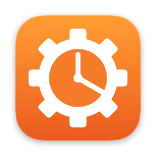
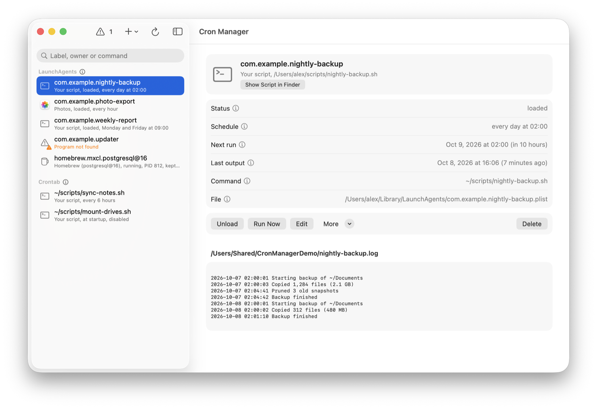
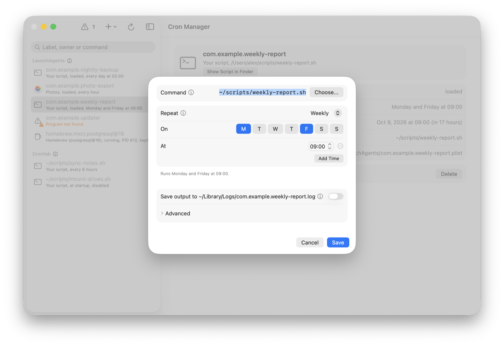
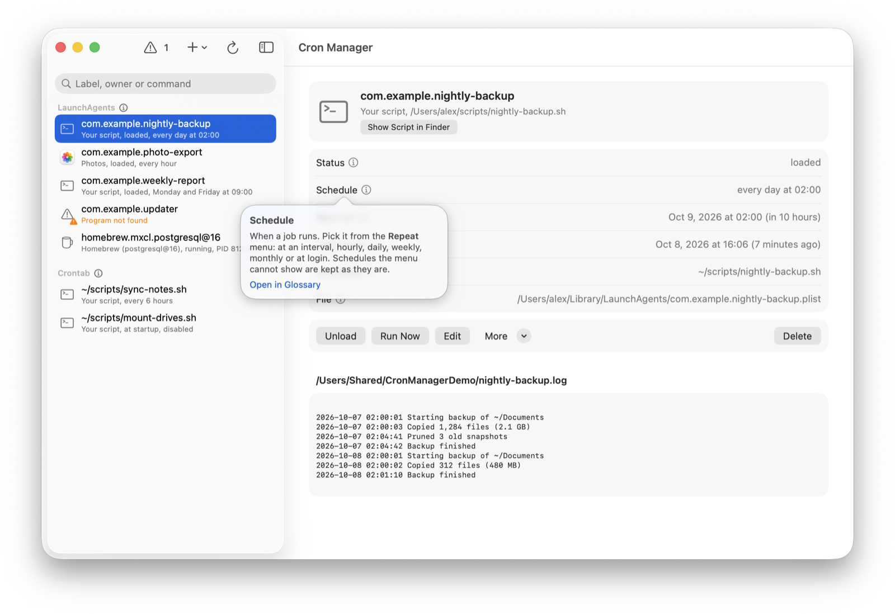
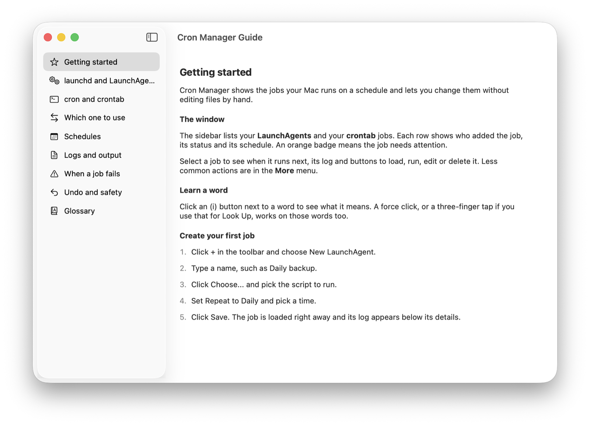

#  Cron Manager

[Features](#features) | [Screenshots](#screenshots) | [Requirements](#requirements) | [Build and install](#build-and-install) | [Opening a downloaded build](#opening-a-downloaded-build) | [Permissions](#permissions) | [What it changes](#what-it-changes-on-your-mac) | [License](#license)

A native macOS app for the jobs your Mac runs on a schedule: your LaunchAgents and your crontab. See what runs, who added it and when it runs next. Change it without editing plists or cron syntax by hand.



## Features

- Lists the LaunchAgents in `~/Library/LaunchAgents` and your crontab jobs, with status, schedule, owner app and next run
- Flags jobs that need attention, such as a missing program or log folder or a failed last run, with a hint on how to fix each
- Create and edit jobs with a Repeat menu (interval, hourly, daily, weekly, monthly, at login) instead of cron syntax
- Load, unload, run now, duplicate and delete; cron jobs can be disabled without deleting them
- Live log view, plus a live output window when running a cron job
- Convert a cron job to a LaunchAgent
- Restore the previous version of any job you edited
- A built-in guide and glossary for people new to launchd and cron

## Screenshots

| Editing a job | Learning a term |
| --- | --- |
|  |  |



## Requirements

- macOS 26 or later
- Command Line Tools for building (`xcode-select --install`). Xcode is not needed.

## Build and install

```sh
git clone https://github.com/p3rception/cron-manager.git
cd cron-manager
make
```

`make` builds the app, installs it in `/Applications` and opens it. Other targets:

| Command | What it does |
| --- | --- |
| `make test` | Runs the parser and schedule checks |
| `make uninstall` | Removes the app and keeps your backups |
| `make clean` | Deletes build output |
| `./build.sh build` | Builds `dist/CronManager.app` without installing |

The app is signed with your Apple Development certificate if you have one, otherwise ad-hoc. To use your own bundle ID, copy `.env.example` to `.env` and set `BUNDLE_ID`.

## Opening a downloaded build

Builds attached to a release are not notarized by Apple, so macOS blocks them the first time. An app you build yourself with `make` does not have this problem.

1. Move `CronManager.app` to `/Applications`.
2. Open it. macOS says it cannot verify the developer; click **Done**.
3. Open **System Settings > Privacy & Security**, scroll to **Security** and click **Open Anyway** next to Cron Manager.
4. Confirm with your password or Touch ID.

Or remove the quarantine flag in Terminal:

```sh
xattr -dr com.apple.quarantine /Applications/CronManager.app
```

## Permissions

- The first time the app changes your crontab, macOS may ask whether Cron Manager may administer your computer. Allow it, or crontab changes fail.
- Cron jobs that read Documents, Desktop or external drives need Full Disk Access for `/usr/sbin/cron` in **System Settings > Privacy & Security > Full Disk Access**.

## What it changes on your Mac

- Only your own jobs: `~/Library/LaunchAgents` and your user crontab. System LaunchDaemons are left alone and no administrator password is asked for.
- Before each save, the previous version is copied to `~/Library/Application Support/CronManager`.
- Deleted LaunchAgents go to the Trash. Disabled cron jobs stay in the crontab as lines starting with `#off`.

## License

[MIT](LICENSE)
